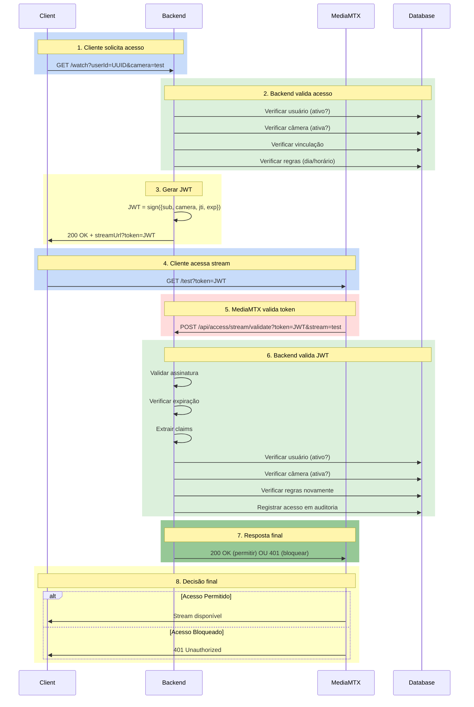

# 🏛️ ARQUITETURA DE SEGURANÇA - DIAGRAMA VISUAL

## Fluxo Completo de Autenticação



## Estrutura de Dados - JWT Claims

```
Token JWT = Header.Payload.Signature

┌─────────────────────────────────────────┐
│ Header (HMAC-SHA256)                     │
├─────────────────────────────────────────┤
│ {                                        │
│   "alg": "HS256",                        │
│   "typ": "JWT"                           │
│ }                                        │
└─────────────────────────────────────────┘
              ↓
┌─────────────────────────────────────────┐
│ Payload (Claims)                         │
├─────────────────────────────────────────┤
│ {                                        │
│   "sub": "f47ac10b-58cc-4372-...",      │ ← userId
│   "camera": "test",                      │ ← streamName
│   "jti": "550e8400-e29b-41d4-...",      │ ← unique id
│   "iat": 1714996200,                     │ ← issued at
│   "exp": 1714996260,                     │ ← expires in 60s
│   "iss": "CameraAccessAPI",              │ ← issuer
│   "aud": "CameraClients"                 │ ← audience
│ }                                        │
└─────────────────────────────────────────┘
              ↓
┌─────────────────────────────────────────┐
│ Signature                                │
├─────────────────────────────────────────┤
│ HMAC_SHA256(                             │
│   header.payload,                        │
│   "MySecretKeyForTesting..."             │
│ )                                        │
└─────────────────────────────────────────┘
```

## Camadas de Validação

```
Layer 1: Signature Verification
┌──────────────────────────────────────┐
│ HMAC-SHA256(header.payload, secret)  │
│ Falha → Rejeitar (token adulterado)  │
└──────────────────────────────────────┘
          ↓ ✅
Layer 2: Expiration Check
┌──────────────────────────────────────┐
│ now > exp?                            │
│ Sim → Rejeitar (token expirado)      │
└──────────────────────────────────────┘
          ↓ ✅
Layer 3: Claims Extraction
┌──────────────────────────────────────┐
│ Extract: sub, camera, jti, iat, exp  │
│ Falta algum → Rejeitar               │
└──────────────────────────────────────┘
          ↓ ✅
Layer 4: User Validation
┌──────────────────────────────────────┐
│ User exists?                          │
│ User active?                          │
│ Não → Rejeitar                        │
└──────────────────────────────────────┘
          ↓ ✅
Layer 5: Camera Validation
┌──────────────────────────────────────┐
│ Camera exists?                        │
│ Camera active?                        │
│ Não → Rejeitar                        │
└──────────────────────────────────────┘
          ↓ ✅
Layer 6: User-Camera Link
┌──────────────────────────────────────┐
│ User linked to camera?                │
│ Não → Rejeitar                        │
└──────────────────────────────────────┘
          ↓ ✅
Layer 7: Schedule Rules
┌──────────────────────────────────────┐
│ Day of week allowed?                  │
│ Time in range?                        │
│ Não → Rejeitar                        │
└──────────────────────────────────────┘
          ↓ ✅
✅ ACESSO PERMITIDO
```

## Modelo de Banco de Dados

```
┌─────────────────────────────────────┐
│ users                               │
├─────────────────────────────────────┤
│ id (UUID)                           │
│ name (string)                       │
│ document (string)                   │
│ active (boolean) ← CRÍTICO          │
│ created_at                          │
│ updated_at                          │
└─────────────────────────────────────┘
       │
       │ 1:N relationship
       ▼
┌─────────────────────────────────────┐
│ access_rules                        │
├─────────────────────────────────────┤
│ id (UUID)                           │
│ user_id (FK)                        │
│ camera_id (FK)                      │
│ allowed (boolean) ← CRÍTICO         │
│ active (boolean) ← CRÍTICO          │
│ days_of_week (array)                │
│ start_time (time)                   │
│ end_time (time)                     │
│ created_at                          │
│ updated_at                          │
└─────────────────────────────────────┘
       ▲
       │
       │ 1:N relationship
┌─────────────────────────────────────┐
│ cameras                             │
├─────────────────────────────────────┤
│ id (UUID)                           │
│ name (string) ← usado como          │
│ description (string)     streamName │
│ rtsp_url (string)                   │
│ is_active (boolean) ← CRÍTICO       │
│ created_at                          │
└─────────────────────────────────────┘

┌─────────────────────────────────────┐
│ user_cameras (linking table)        │
├─────────────────────────────────────┤
│ user_id (FK)                        │
│ camera_id (FK)                      │
│ created_at                          │
└─────────────────────────────────────┘

┌─────────────────────────────────────┐
│ access_logs (auditoria)             │
├─────────────────────────────────────┤
│ id (UUID)                           │
│ user_id (FK)                        │
│ camera_id (FK)                      │
│ timestamp                           │
│ allowed (boolean)                   │
│ reason (string)                     │
│ source (string) ← MediaMTX_Stream   │
└─────────────────────────────────────┘
```

## Estados Possíveis

```
┌─────────────────────────────────────────────────────────┐
│ TOKEN REQUEST STATES                                    │
└─────────────────────────────────────────────────────────┘

GET /watch?userId=X&camera=Y

    │
    ├─ Usuário não existe → 401 Unauthorized
    ├─ Usuário inativo → 401 Unauthorized
    ├─ Câmera não existe → 401 Unauthorized
    ├─ Câmera inativa → 401 Unauthorized
    ├─ Sem vinculação → 401 Unauthorized
    ├─ Fora do horário → 401 Unauthorized
    │
    └─ ✅ TUDO OK → 200 OK + streamUrl?token=JWT


┌─────────────────────────────────────────────────────────┐
│ TOKEN VALIDATION STATES (MediaMTX)                      │
└─────────────────────────────────────────────────────────┘

POST /api/access/stream/validate?token=JWT&stream=X

    │
    ├─ Token ausente → 401 Unauthorized
    ├─ Token inválido → 401 Unauthorized
    ├─ Assinatura alterada → 401 Unauthorized
    ├─ Token expirado → 401 Unauthorized
    ├─ Usuário não existe → 401 Unauthorized
    ├─ Usuário inativo → 401 Unauthorized
    ├─ Câmera não existe → 401 Unauthorized
    ├─ Câmera inativa → 401 Unauthorized
    ├─ Sem vinculação → 401 Unauthorized
    ├─ Fora do horário → 401 Unauthorized
    ├─ Token revogado → 401 Unauthorized
    │
    └─ ✅ TUDO OK → 200 OK {status: "ok"}
```

## Matriz de Segurança

```
┌──────────────────────────────────────────────────────────────────┐
│ CENÁRIO                  │ RESULTADO    │ HTTP CODE │ RAZÃO      │
├──────────────────────────────────────────────────────────────────┤
│ Token válido, no horário │ ✅ Permitido │ 200 OK    │ Todas OK   │
│ Token expirado           │ ❌ Bloqueado │ 401       │ Exp check  │
│ Token adulterado         │ ❌ Bloqueado │ 401       │ Signature  │
│ Sem token                │ ❌ Bloqueado │ 401       │ Empty      │
│ Usuário inativo          │ ❌ Bloqueado │ 401       │ User.active│
│ Câmera inativa           │ ❌ Bloqueado │ 401       │ Camera.active
│ Fora do horário          │ ❌ Bloqueado │ 401       │ Schedule   │
│ Câmera incorreta         │ ❌ Bloqueado │ 401       │ Mismatch   │
│ Sem vinculação           │ ❌ Bloqueado │ 401       │ Link       │
└──────────────────────────────────────────────────────────────────┘
```

## Fluxo de Revogação (Logout)

```
1. Usuário faz logout
   DELETE /api/auth/logout

2. Token ID (JTI) é adicionado à lista de revogação
   RevokedTokenIds.Add(jti)

3. Próxima validação do token
   POST /api/access/stream/validate?token=JWT
   
4. IsTokenRevokedAsync(jti) retorna true
   
5. Acesso negado → 401 Unauthorized
```

## Clean Architecture - Separação de Responsabilidades

```
┌─────────────────────────────────────────────────────────┐
│ PRESENTATION LAYER (API)                                │
│ ┌────────────────────────────────────────────────────┐  │
│ │ WatchController           AccessController         │  │
│ │ GET /watch               POST /api/access/stream   │  │
│ └────────────────────────────────────────────────────┘  │
└─────────────────────────────────────────────────────────┘
              ↓ Depends on Interfaces
┌─────────────────────────────────────────────────────────┐
│ APPLICATION LAYER (Business Logic)                      │
│ ┌────────────────────────────────────────────────────┐  │
│ │ IStreamTokenService              Interface         │  │
│ │ └─ ValidateAndExtractClaimsAsync()                 │  │
│ │ └─ IsTokenRevokedAsync()                           │  │
│ │ └─ RevokeTokenAsync()                              │  │
│ │                                                     │  │
│ │ IStreamAccessValidationService   Interface         │  │
│ │ └─ ValidateStreamAccessAsync()                     │  │
│ │ └─ ResolveStreamNameToCameraIdAsync()              │  │
│ └────────────────────────────────────────────────────┘  │
└─────────────────────────────────────────────────────────┘
              ↓ Depends on Interfaces
┌─────────────────────────────────────────────────────────┐
│ INFRASTRUCTURE LAYER (Implementation)                   │
│ ┌────────────────────────────────────────────────────┐  │
│ │ StreamTokenService           (JWT Validation)      │  │
│ │ StreamAccessValidationService (Access Rules)       │  │
│ │ AppDbContext                  (Persistence)        │  │
│ └────────────────────────────────────────────────────┘  │
└─────────────────────────────────────────────────────────┘
```

---

Criado: 2026-05-06
Versão: 1.0
Status: ✅ Pronto para Documentação
